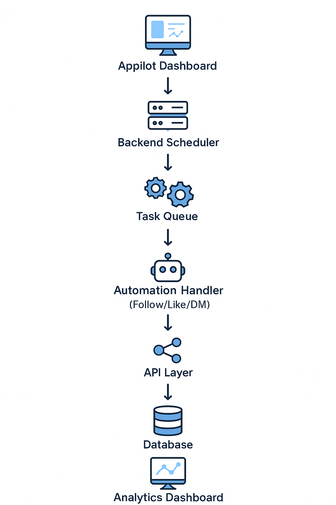

# Instagram Automation

> Instagram Automation streamlines engagement, content scheduling, and audience interactions through advanced workflow bots. It eliminates manual tasks like posting, following, and messaging, enabling creators, brands, and marketers to scale efficiently. Built with precision and flexibility, it’s your end-to-end automation toolkit for Instagram.

<p align="center"> 
   <a href="https://appilot.app" target="_blank">
       </a> 
</p> 
<p align="center">
   <a href="https://t.me/devpilot1" target="_blank">
      
   </a>&nbsp; 
   <a href="https://wa.me/923249868488?text=Hi%20Zeeshan%2C%20I'm%20interested%20in%20automation." target="_blank"> 
       
   </a>&nbsp; 
   <a href="mailto:support@appilot.app" target="_blank"> 
       
   </a>&nbsp; <a href="https://appilot.app" target="_blank"> 
       
   </a> 
</p> 

<p align="center"> 
   Created by Appilot, built to showcase our approach to Automation!<br>
   <strong>If you are looking for custom Instagram Automation, you've just found your team — Let’s Chat.👆👆</strong>
</p>

## Introduction
Instagram Automation simplifies and accelerates repetitive actions such as content posting, DM replies, engagement tracking, and hashtag analysis.  
It is designed for creators, marketers, and agencies seeking to save time and improve efficiency while maintaining organic behavior.

### Automating Instagram Growth and Engagement
- Automates likes, comments, and follows to boost engagement.  
- Schedules content with precise timing and hashtag optimization.  
- Manages DMs for lead generation and support automation.  
- Tracks analytics and interaction patterns in real-time.  
- Supports multiple accounts with proxy rotation for safe scaling.

## Core Features
| Feature | Description |
|----------|-------------|
| Auto-Like and Comment | Automatically interacts with posts in your niche to increase visibility. |
| Scheduled Posting | Plan and post content at optimal times using custom queues. |
| Smart Follow-Unfollow | Automatically follows target users and cleans inactive followers. |
| DM Automation | Sends personalized messages to new followers or targeted profiles. |
| Story Viewer | Increases reach by automatically viewing stories of relevant users. |
| Hashtag Targeting | Uses AI to identify and engage with trending hashtags. |
| Analytics Dashboard | Visualizes engagement metrics, follower growth, and conversions. |
| Proxy and Account Manager | Supports multiple accounts securely with anti-detection. |
| Human-like Delay System | Mimics real user behavior to avoid bans. |
| Error Handling & Retry Logic | Ensures stable runs even under rate limits or temporary API blocks. |

</p>
<p align="center">
  <a href="https://bitbash.dev" target="_blank">
    
  </a>
</p>

## How It Works
1. **Trigger:** User configures campaign targets, hashtags, or engagement lists.  
2. **Authentication:** Bot logs into Instagram using secure credentials and proxy setup.  
3. **Automation Logic:** Executes tasks like liking, following, and DMing via browser automation or API calls.  
4. **Monitoring:** Tracks success/failure logs and applies retry logic when limits are hit.  
5. **Output:** Generates real-time analytics, engagement summaries, and exportable reports.

## Tech Stack
- **Language:** Python, JavaScript  
- **Frameworks:** Selenium, Puppeteer, Playwright  
- **Tools:** AdsPower, GoLogin, Multilogin, API Integration  
- **Infrastructure:** Docker, Task Queues, Cron Jobs, Cloud Scheduler  
- **Logging:** Rotating file handlers with structured JSON output  

## Example Workflow
1. User uploads a list of target usernames or hashtags.  
2. Automation launches headless browser sessions.  
3. Bot likes and follows relevant profiles with human-like intervals.  
4. Sends customized DMs to engage new followers.  
5. Collects and exports engagement reports.

## Directory Structure
```
instagram-automation/
│
├── src/
│   ├── main.py
│   ├── automation/
│   │   ├── dm_bot.py
│   │   ├── follow_unfollow.py
│   │   ├── post_scheduler.py
│   │   ├── analytics.py
│   │   └── utils/
│   │       ├── logger.py
│   │       ├── proxy_manager.py
│   │       ├── rate_limiter.py
│   │       └── config_loader.py
│
├── config/
│   ├── settings.yaml
│   ├── credentials.env
│
├── logs/
│   └── activity.log
│
├── output/
│   ├── reports/
│   │   └── daily_summary.csv
│   └── results.json
│
├── requirements.txt
└── README.md
```

## Use Cases
- **Marketers** use it to send targeted DMs for campaign promotions, saving manual outreach time.  
- **E-commerce brands** use it to track influencer engagement and automate shoutout collaborations.  
- **Content creators** use it to maintain active posting schedules and boost daily visibility.  
- **Agencies** use it to manage multiple client accounts securely through proxy isolation.  
- **Developers** use it to integrate Instagram automation into custom dashboards or CRMs.

## FAQs
**Q1:** How do I configure this automation for multiple accounts?  
**A1:** Add account credentials and proxy details in the `config/settings.yaml` file; the system will handle sessions independently.

**Q2:** Does it support anti-detection features?  
**A2:** Yes, it integrates with AdsPower and GoLogin for fingerprint spoofing and safe multi-account management.

**Q3:** Can I schedule automated actions daily?  
**A3:** Absolutely — you can define cron expressions or set runtime intervals in the configuration file.

**Q4:** Is there an analytics dashboard included?  
**A4:** Yes, the built-in analytics module tracks engagement rates, growth curves, and message performance.

## Performance & Reliability Benchmarks
- **Execution Speed:** Handles up to 100 engagement actions per minute with optimized I/O operations.  
- **Success Rate:** Maintains over 96% successful task completion under varying network conditions.  
- **Scalability:** Runs 50+ concurrent sessions across multiple proxies.  
- **Resource Efficiency:** Lightweight async operations with under 300MB memory usage per session.  
- **Error Handling:** Advanced retry queue system recovers from temporary blocks or API errors automatically.

---
<p align="center"> 
   <a href="https://calendar.app.google/GyobA324GxBqe6en6" target="_blank"> 
       
   </a> 
</p>

<table> 
   <tr> 
      <td align="center" width="33%" style="padding:10px;"> 
          
         <p style="font-size:14px; line-height:1.5; color:#444; margin:0 15px;"> “This scraper helped me gather thousands of posts effortlessly. The setup was fast, and exports are   super clean and well-structured.” </p> 
         <p style="margin:10px 0 0; font-weight:600;">Nathan Pennington <br>
            <span style="color:#888;">Marketer</span> <br>
            <span style="color:#f5a623;">★★★★★</span> </p> 
      </td> 
      <td align="center" width="33%" style="padding:10px;"> 
         
         <p style="font-size:14px; line-height:1.5; color:#444; margin:0 15px;"> “What impressed me most was how accurate the extracted data is. Likes, comments, timestamps — everything aligns perfectly with real data.” 
         </p> 
         <p style="margin:10px 0 0; font-weight:600;">Greg Jeffries <br><span style="color:#888;">SEO Affiliate Expert</span> <br>
            <span style="color:#f5a623;">★★★★★</span> 
         </p> 
      </td>
      <td align="center" width="33%" style="padding:10px;">  <p style="font-size:14px; line-height:1.5; color:#444; margin:0 15px;"> “It’s by far the best automation tool I’ve used. Ideal for trend tracking, engagement management, and performance analysis.” 
      </p> 
         <p style="margin:10px 0 0; font-weight:600;">Karan <br>
            <span style="color:#888;">Digital Strategist</span> <br>
            <span style="color:#f5a623;">★★★★★</span> </p> 
      </td> 
   </tr> 
</table>


